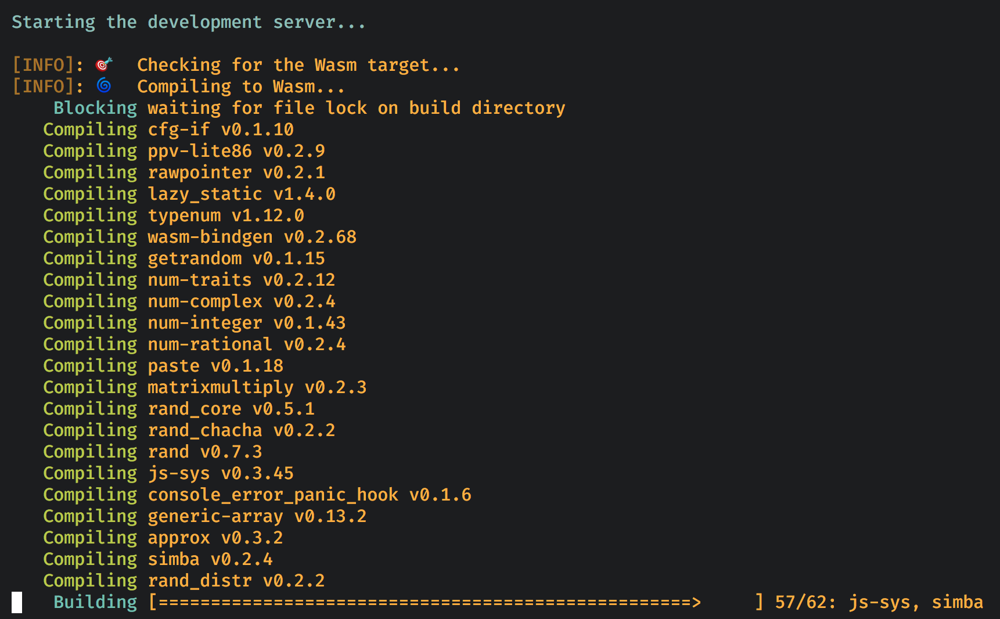
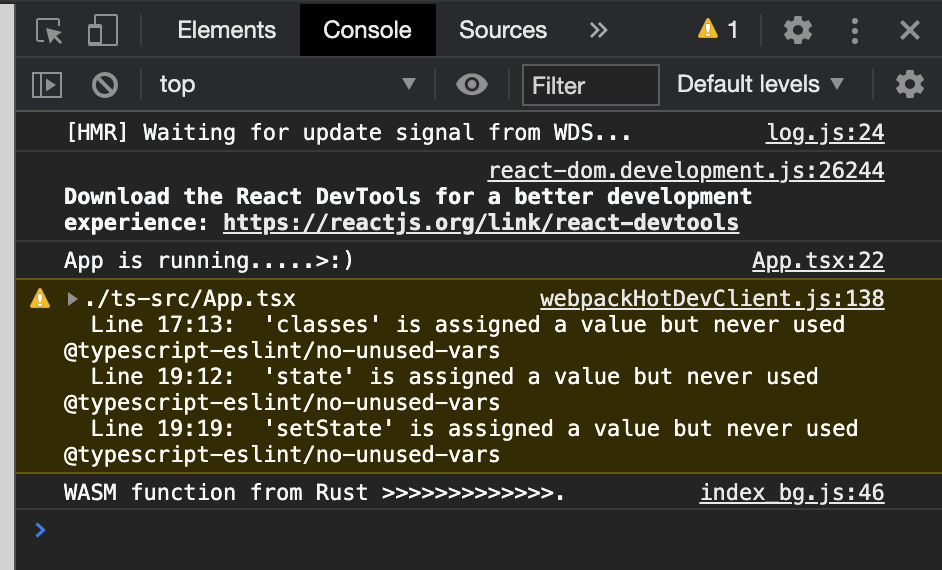
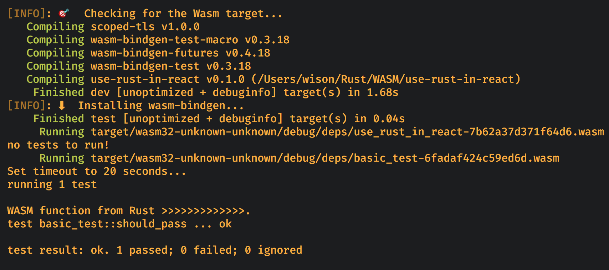
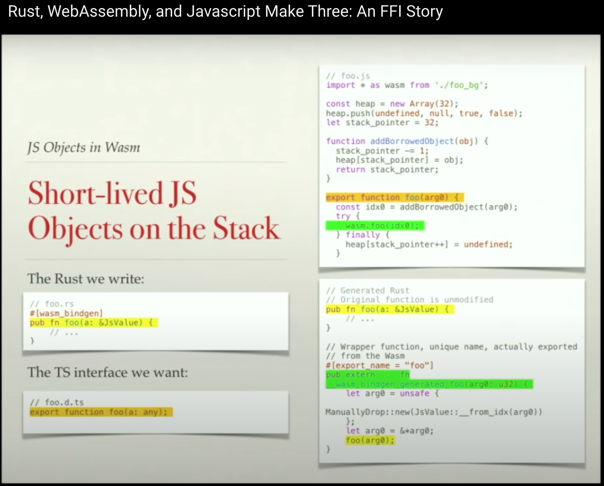
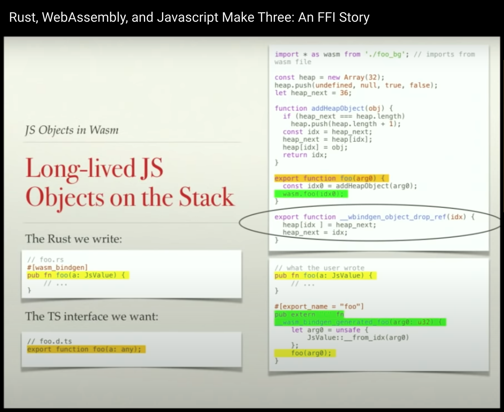

# `WASM` demo to show how to use `Rust` in `React`

## `Rust` installation

```bash
# Install latest rustup on Unix or Linux
curl --proto '=https' --tlsv1.2 -sSf https://sh.rustup.rs | sh

# If you're on Windows, dowload `rustup-init.exe` executable and run it:
# https://static.rust-lang.org/rustup/dist/i686-pc-windows-gnu/rustup-init.exe

# We need this for hot-load
cargo install cargo-watch

# We need this to compile wasm code and run wasm test
cargo install wasm-pack

# Add cross-compilation target
rustup target add wasm32-unknown-unknown
```

Test rust build by running:

```bash
cargo build --target wasm32-unknown-unknown

# You should see the output file: target/wasm32-unknown-unknown/debug/use_rust_in_react.wasm
```

## `React` installation

```bash
npm install
```

Test the web app by running:

`npm start`


## Something you should know

- We use the same root folder both for `React` project and `Rust` project. So we have to 
make some changes for the default settings like below:

    - For the `React` project, the `TypeScript` source folder is `ts-src` (not the default `src`
    which created by `create-react-app`.

    - For the `Rust` project, the source folder is `src`.

- We use `WasmPackPlugin` to run `cargo build` automatically, that means the command below will run automatic 
when you run `npm start`, the `WASM` output will be placed into `pkg` folder:

    ```bash
    cargo build --target wasm32-unknown-unknown
    ```

    That's why you can see the building process below when you run `npm start` for the first time:

    

- For importing the generated `WASM` file in `React` project, we **map** the `wasm` package to the `pkg` 
folder like below in `package.json`. That's why you can do `import 'wasm'` in any react component:
    
    ```js
    "wasm": "file:./pkg"
    ```

    Actually, it will link the `pkg` folder into `node_modules/wasm`.

- You have to re-run `npm start` after you changed `src/lib.rs` (or any module used by `src/lib.rs`), as
**webpack DEV server** can't detect rust source change. 

- Sometimes, after you run or re-run `npm start`, you can't see update in local browser. For that case, plz `refresh`
the page then you should be able to see the result:

    

</br>

## How to test `WASM`

- Add `wasm-bindgen-test` to `Cargo.toml` like below (if not exists yet):

    ```rust
    [dev-dependencies]
    wasm-bindgen-test = "0.3.18"
    ```

- Create any test files under `tests` folder. For example:  **`tests/basic-test.rs`**

    ```rs
    use wasm_bindgen_test::*;

    #[wasm_bindgen_test]
    fn should_pass() {
        assert_eq!(1, 1);
    }
    ```

- Combine `cargo-watch` and `wasm-pack` for auto testing when rust source code saved:

    ```bash
    cargo watch --clear --shell 'wasm-pack test --node'
    ```

    

</br>

## How to build `./pkg` manually?

Actually, `WasmPackPlugin` will run `wasm-pack` automatic to generate the `wasm` file and 
all `JavaScript` glue code for you and then place all of them into `pkg` folder (all output 
file names start with `index` prefix and NOT build in `release` mode). 

But you still can generate the `pkg` content by manually to run `wasm-pack` like below.
All output file names start with the package name in `Cargo.toml`:

```bash
# The default command `WasmPackPlugin` to run.
wasm-pack build --target bundler

# But you can build it in release mode, or use different target.
wasm-pack build --target nodejs --release
```

</br>

## What's under the hood?

If you want to know how `wasm-bindgen` works, here is the good talk about all the technical details
to explain how's is work:

[`Rust, WebAssembly, and Javascript Make Three: An FFI Story`]( https://www.youtube.com/watch?v=nvLw_XKlZaU&t=989s)






</br>

